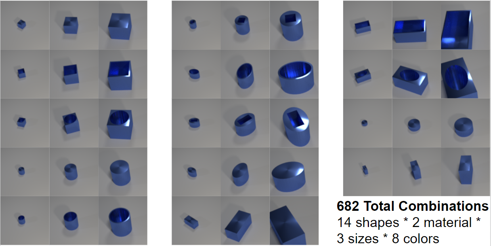
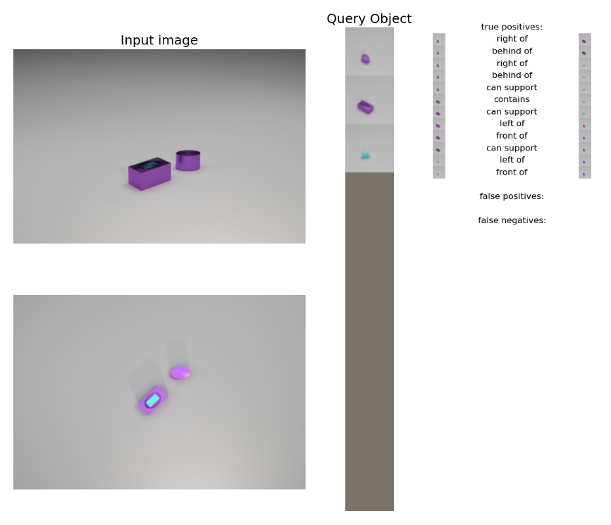
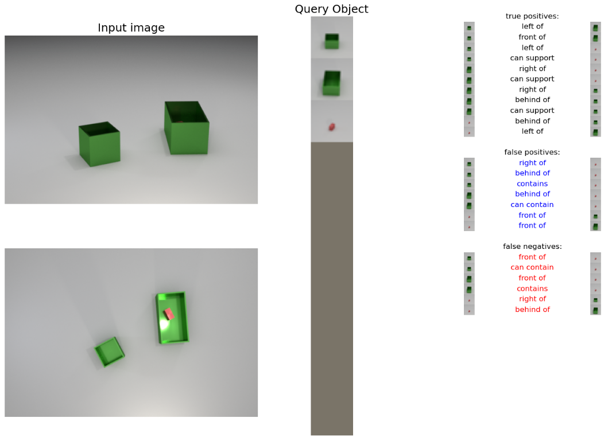
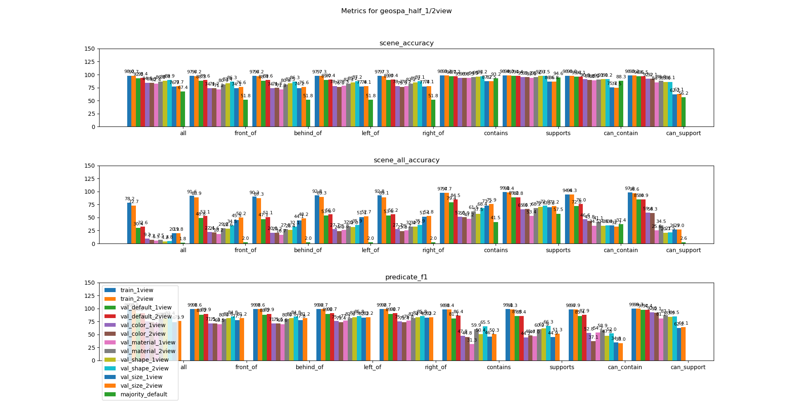
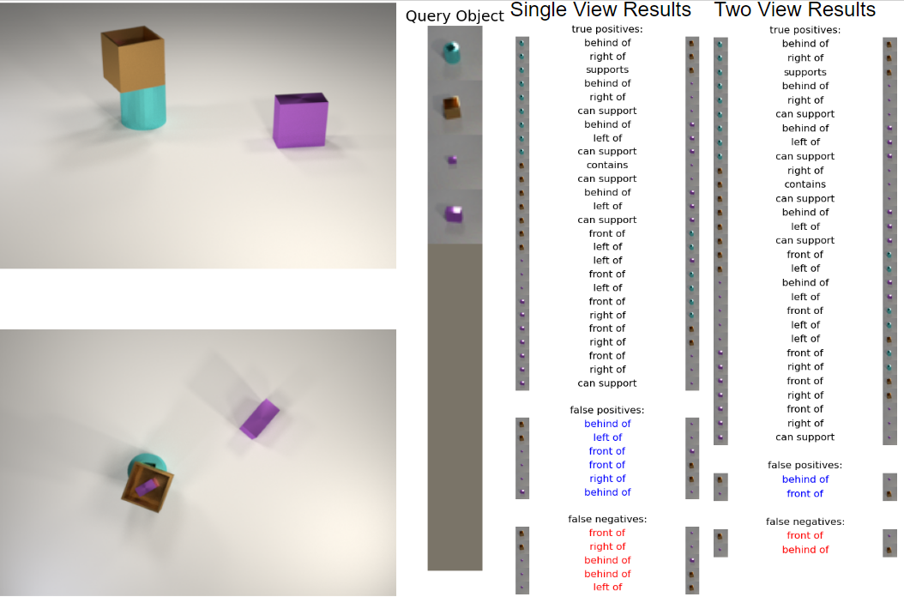
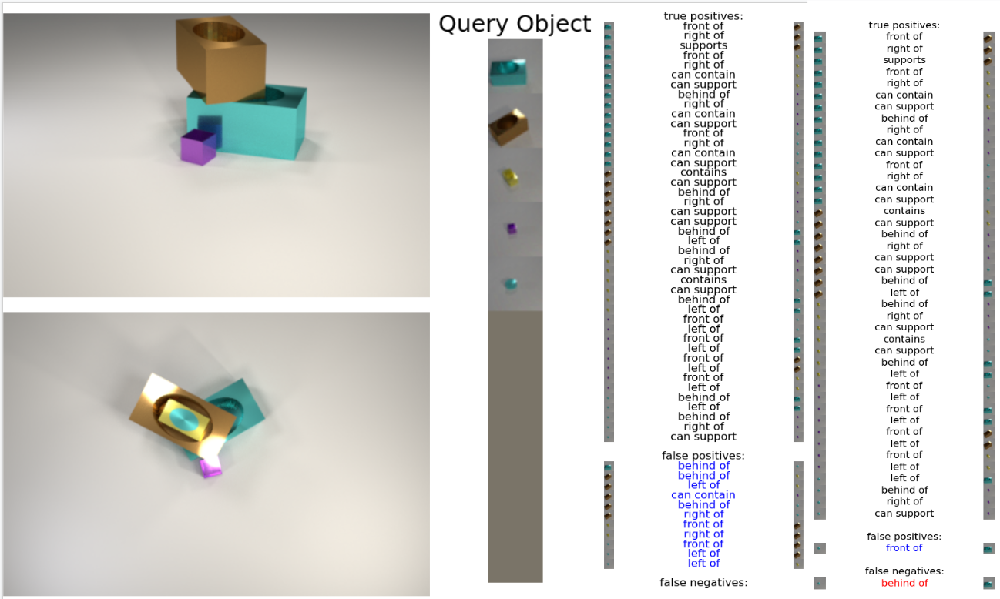
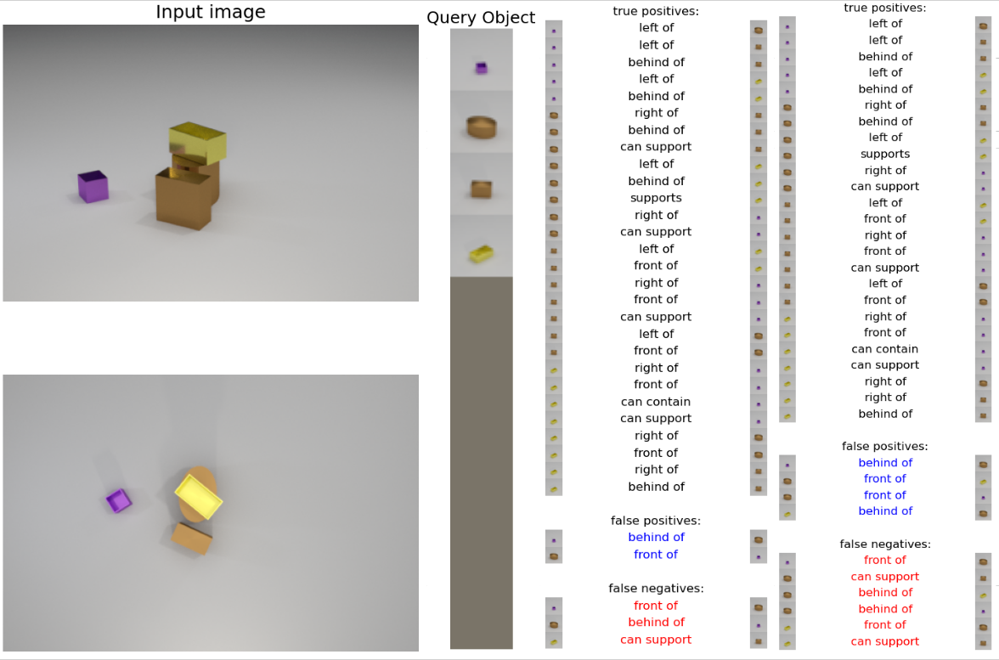

### Table of Contents
1. [Introduction](#1-introduction)
2. [Dataset](#2-dataset)
3. [Model](#3-model)
4. [Results](#4-results)
5. [Conclusion](#5-conclusion)

# 1. Introduction

This project has the goal of determining how the [SORNet](https://wentaoyuan.github.io/sornet/) model would perform on a new dataset which includes geometric reasoning in addition to spacial reasoning. SORNet was initially designed to learn about and infer object spacial relationships, and could determine the relative positions between objects in an RGB image scene. It performed well on existing datasets such as CLEVR, which contain computer generated scenes with a variety of objects placed on a table. 

We wanted to test the SORNet architecture's ability to conduct more complex geometric reasoning about the objects, the existing relationships between objects, and the potential relationships which could exist. Geometric reasoning includes understanding containment and support of other objects, and understanding if it's possible to contain one object's geometry within another object, or if it's possible for one object to stably support another. In this page we go over the dataset we created, how we applied the new dataset to the SORNet model, and the results we found from our tests.

# 2. Dataset

## Related Work

There have been a range of impressive datasets for spacial reasoning models, including datasets using static image for directional relationships (CLEVR), videos for temporal and causal reasoning (CLEVERER), and videos including long term temporal and containment reasoning (CATER). Our diagnostic dataset is most similar to CLEVR, using static images with a fixed set of shapes, sizes, and materials. It includes ground truth information about the objects in each scene and the relative directional relationships between those objects (left, right, in front, behind). Our dataset improves on the previous examples by including new more complex ways for objects to be oriented in the scenes and more ground truth information for the relationships between objects. In addition to being placed “independently” on the table, objects can be contained within eachother, or supported on top of one another. In addition, we include the ground truth information for the possible relationships between objects; we store information about if objects could be contained or supported by other objects in the scene based on their relative sizes and shapes. The contain and support predicates are defined and discussed more below.

## Geometric Relationship Definitions

There are guidelines for how objects can be oriented within the scene depending on their size and shape. We came up with three distinct terms to describe the different methods of placing objects: independent, contained, and supported. Any object can be placed independently, meaning the object is placed on the table not touching any other objects. The contained and supported relationships are defined below:

**Contained:**
an object (containee) is able to be contained by another object (container) when more than half of the bounding box of the containee is able to fit inside of the bounding box of the container such that the container and containee are not intersecting. An equivalent definition would say that the center point of the bounding box of the containee must fit inside of the bounding box of the container. 

**Supported:**
 an object (supportee) can be supported by another object (supporter) if the cross section of the supporter’s bounding box along the table’s plane can fully contain the cross section of the supportee’s bounding box.
 
## Objects

In our primary dataset there are 14 unique shapes ranging in 3 different sizes for a total of 42 different shapes. There are also 2 different materials and 8 different colors.

### Shapes

### Materials

The two different materials are metal and rubber. The difference is that the rubber material is matte and non-reflective while the metal material is highly reflective.

### Colors

The 8 colors included in the main dataset are gray, red, blue, green, brow, purple, cyan, and yellow.

### Other objects

The scene generation code is designed so that is also very easy to change the properties for objects used in the scenes. A single file contains a list of all shapes, colors, materials, and sizes to use during generation. In order to change the objects in scenes a user only needs to create new Blender objects and change the parameters file for scene image generation. To test our model on novel scenes, we also created a kitchen dataset with the same colors and materials, but new objects with more complex geometry than the existing images to resemble real life objects found in a kitchen.

**TODO: include kitchen images**

## Generation 

Our scene generation process is very similar to that of CLEVR. To generate a scene, we start with a hand-designed default scene containing 6 cameras, a flat gray plane to act as the table, and lighting. Each scene uses the same base table, cameras, and lights, but for each new scene, random jitter is added to the camera and light positions.

For each scene a random number between three and six objects is chosen. For each new object to add, a distinct combination of size, shape, material, and color are chosen. Then based on the size and shape of the new object, we create two lists: the existing objects in the scene which can act as supporters or containers, respectively, for the new object. It’s only possible for an object to have a single “child” containee or supportee, so if any object is already containing or supporting a child object, then it’s not appended to the list and not considered as a candidate. Next, the method of placement is randomly chosen for the object: independent, contained, or supported. If the chosen method is independent, then we choose a random position and orientation until the new object is not in collision with any existing objects. If the method is supported or contained, then a “parent” supporter or container is randomly chosen and the object is placed accordingly. 

Once all objects have been placed in a scene, the ground truth predicates are generated and the scene is saved. 

## Relationships

There are a total of 8 relationships included in the ground truth data: left, right, in front, behind, contains, supports, can contain, and can support. The left, right, in front, and behind predicates are generated the same as CLEVR and indicate the directional relationships between object pairs.  The contains and supports predicates indicate the current orientation of objects within the scene based on the placement type (independent, contained, supported). 

The can-contain and can-support predicates represent the potential for objects to fit contained inside of or supported on top of other objects based on the scene, including considering any objects already contained or supported. For both the can-contain and can-support relationships, object A can be contained/supported by object B if object A can be moved to fulfil the definition of the contain/support relationship (defined above) without disturbing any other objects in the scene. Some potential cases if object A can be contained/supported in object B are outlined below.

*Object A already a supporter.*
If object A is already supporting another object C, then it cannot be contained/supported by any other object B since object C would likely fall off. 

*Object A already a container.*
If object A is containing another object D, then object D will remain inside of object A even if object A is moved, so we must still consider if object B can contain/support object A. 

*Object B already a container/supporter.*
If object B is already containing/supporting object E, then when considering can contain/support of object A, we consider the size and shape of object E. We do not consider the position of object E i.e., it would be acceptable for object E’s position to shift slightly as we move object A into the relationship in/on object B. 

Definitions of can-contain and can-support predicates:

**Can-contain:**
Its possible for object A to be contained inside of object B such that object A can be moved into object B without disturbing any other objects in the scene. Any objects already contained within object B in the scene must be able to be in object B along with object A.

**Can-support:**
It’s possible for object A to be supported on object B such that object A can be moved onto object B without disturbing any other objects in the scene. Any objects already supported above object B in the scene must be able to be on object B along with object A.

---

# 3. Model

### Related Work

For our training model we use the [SORNet](https://wentaoyuan.github.io/sornet/) design with slight modifications to accept our predicates and multiple camera views. To learn more about the implementation details of SORNet visit the dedicated website.

{% include carousel.html unit="%" number="1" %}

*Images above from [SORNet paper](https://arxiv.org/abs/2109.03891)*

### Training and Hyperparameter

**TODO**

### Testing and Experiment Setup

**TODO**

---

# 4. Results

## 1-view Results

### Qualitative Analysis

This is a scene from the validation-default split, evaluated on the 1view model.
This means that all objects were seen during training, even tough this exact scene was not, and only the “original view” on the top was used to predict the predicates.
On the left are the input images, and the second, top-view is just shown for your reference.
In the middle are the canonical views of the query objects.
You can see that there are three objects in the scene: a small elliptical cylinder, a rectangle elliptical container, and a teal rectangle.
On the right are the list of predicates.
For example, the tiny purple is on the right of the bigger rectangle, and predicted as such, so it is a “true positive”
Another example is that the small purple cylinder “can support” the teal rectangle, because its top has a larger surface area than the supported.
You can see that the 12 “true” predicates are all predicted correctly, with no false positives or false negatives.

This is an example from validation-color: all objects are of same shapes, material, and sizes, except the colors red, green, blue, and gray are not seen during training.
We can see that more predicates are guessed incorrectly.
To specify, it is confusing the location of the red object, because it is completely occluded from the scene.
Just looking at the original view, it is impossible to tell whether the red object is inside either of the containers or behind either of the containers.
Hence, the model incorrectly predicts many predicates related to the location and containment of the red object.

### Quantitative Analysis

The first and most intuitive metric is the scene accuracy, which is the average accuracy of each predicate over the dataset.
For example, if 7 out of 10 “contains” predicates were predicted true in a scene and  4 out of 5 “contains” predicates were predicted true in another, the scene accuracy of the model over these two scenes is 75%.

Starting from the left are metrics for all predicates, the spatial predicates (front, behind, left, right), and the geometric predicates (contain, support, can…).
Each of the bars indicate the 1 view and the majority model evaluated on each of the datasets.
Majority models always choose the majority pick (1 if there are more true predicates then false, and 0 if there are more false predicates then true) for each predicate, and is meant to show the distribution of the predicates.

Starting with all predicates, one can see that the model achieves 99% accuracy over the training data, 95% accuracy over validation default with only seen objects, and 80 to 90% accuracy for validation sets.
The right-most two bars indicate that validation default had 68.6% of the predicates as “false” while validation kitchen had 71.8% of the predicates as “false.”

Moving on to spatial predicates, one can see that performance is quite consistent over all spatial predicates.
There’s close to 50/50 split in the predicates, the model does worst in validation_op with about 70% accuracy.
We hypothesize that this is because different unseen attributes result in different kinds of error and those errors are accumulated if there are multiple unseen attributes present like in the case of validation op.
Most other validation sets stay around 80% to 85% range, with the color and material having the biggest impact in performance.

Performance over geometric predicates vary, because they each have different distributions and assumptions.
Contains is one of the easiest predicates to predict, because around 95% of the predicates are false.
Intuitively, out of all pairs of objects in a scene, there can only be so many containment relationships.
Hence, the models perform well in terms of accuracy, but a better metric to evaluate these results would be the F1 score, which takes into account the distribution of the predicates by weighing the false and true positives accordingly.
We can still observe that the accuracy of the 1view model is better than that of the majority model.

The trend of geometric predicates are a little more obvious when looking at the can-predicates, because they are more evenly distributed between true and false.
While validation op is still the worst performing, validation_size is not too far from validation_op.
We hypothesize that this is because the model memorizes the size difference between small and medium objects, so it is not able to generalize well to large unseen objects.

Scene all accuracy is the proportion of scenes where all of the predicates were predicted correctly.
For example, if 3 out of 4 was predicted correctly, and 2 out of 2 were predicted correctly, the scene all accuracy would be 50%.
The motivation is to see how many scenes are “perfectly” predicted and applied to robotics applications.
Scene all accuracy mostly amplifies the differences and trends from scene accuracy, so we do not see new trends arise.
However, it is worth noting that even with new scenes consisting of only seen objects, only 32.6% of the scenes are predicted perfectly.
Considering that there are uniform 2~6 objects in a scene, the median of the number of predicates in each scene range from 2 * 1 * 8 = 16 to 6 * 5 * 8 = 240.

The f1-scores also show similar trends, but with a couple extra takeaways.
The f1-scores for majority models are undefined because it only predicts a single value.
The f1 scores for contains-predicates of validation kitchen are also 0, because no kitchen obj
It is also worth noting that even though the accuracies of geometric predicates were extremely high in the 90% range, the f1-scores are relatively low.
As there are more “false” predicates for geometric predicates, the predictions have many more false negatives, leading to lower recall and f1-scores.

## 2-view Results

### Qualitative Analysis

{% include carousel.html unit="%" number="4" %}

The setup is almost identical with the 1view results, with 2 input images and a few query object patches.
On the left are the results from the 1 view model, which only uses the “original” view in the top, and on the right are the results from the 2-view model, which uses both the views.

Here, the 2 view models is performing better than the 1-view model as expected.
The 1 view model incorrectly predicts the small teal cylinder’s spacial relations, because the model is unsure of that object’s position.
This is expected, as one cannot be sure whether the occluded object is inside the brown, behind the yellow, or behind the yellow object, just by looking at the first view.
The 2-view model can eliminate this issue by looking at the top view to figure out the teal object’s location.

This is another example where the 2-view model performs better than the 1-view model.
The yellow container and the teal contained are both completely occluded, so the 1-view model is unable to predict its predicates, while the 2-view model can.

However, it is also worth noting that the 2-view model does not always perform better.
In this example, adding the top view actually introduces more confusions in comparing the position of the yellow container with those of other objects.
Instead of predicting that the yellow container is in front of the brown cylinder, it predicts otherwise.
We have not conducted further experiments to identify the reason for this, but hypothesize that the 2-view model learns more complex reasoning and hence requires more epochs to learn the correct relation.

### Quantitative Analysis

These are the metrics for the 1view and 2view models as shown in the legends.
The marked bars represent the results of the 2-view model and the evaluation on a dataset are put side by side.

As you can see, the scene accuracy of the 2-view model is in general about 1% higher than that of the 1-view model.
However, the accuracy for validation_kitchen is actually lower for the 2-view model, hinting that while 2-view model has potential to do better, it might be overfitting or memorizing the input objects more than the 1-view model.
It is also worth noting that for some geometric predicates such as the can contain and can support, the 2-view model does worse on the validation_size, showing that the 2-view model may be overfitting to the size of the objects.

As with the 1-view results, the scene all accuracy amplifies the differences shown in scene accuracy.
In the case of f1 scores, the 2-view model does worse than the 1-view model for most predicates when evaluated on validation_kitchen.

# 5. Conclusion

### Larger Implications

From these results, our conclusions are two-fold.
First, we observed that the SORNet architecture with the ViT embedding network and fully connected readout networks succeeded in generalizing over unseen objects.
While performance did drop for more unseen attributes, SORNet was still able to query the scene with unseen objects to find their relations.
Second, while the 2-view mode was able to see occluded objects and perform slightly better, it may be overfitting to the training set more than the 1-view model.

### Future Work

Having only the bare minimum set of attributes, it is very possible that the model was not able to generalize to the huge feature space that it might encounter in real-life situation.
Hence, we can increase the number of colors, sizes, and shapes to see if the model can generalize better when given more diverse set of objects.
Fine-tune on a smaller set of scenes with unseen objects to see if the trained model can be quickly fine-tuned to other settings
Test how well the model generalizes to realistic scenes -> is there any sim-to-real gap?

## References

Johnson, J., Hariharan, B., Van Der Maaten, L., Fei-Fei, L., Lawrence Zitnick, C. and Girshick, R., 2017. Clevr: A diagnostic dataset for compositional language and elementary visual reasoning. In Proceedings of the IEEE conference on computer vision and pattern recognition (pp. 2901-2910).

Yi, K., Gan, C., Li, Y., Kohli, P., Wu, J., Torralba, A. and Tenenbaum, J.B., 2019. Clevrer: Collision events for video representation and reasoning. arXiv preprint arXiv:1910.01442.

Girdhar, R. and Ramanan, D., 2019. CATER: A diagnostic dataset for Compositional Actions and TEmporal Reasoning. arXiv preprint arXiv:1910.04744.

Yuan, W., Paxton, C., Desingh, K. and Fox, D., 2022, January. SORNet: Spatial object-centric representations for sequential manipulation. In Conference on Robot Learning (pp. 148-157). PMLR.

## Acknowledgements

This work was partially supported by **UW Allen School Postdoc Research Award** and **REU summer 2021 as part of NSF NRI Award 2024057**. We would like to thank Wentao Yuan, Chris Paxton, and Professor Dieter Fox for their feedback and support during the project.

We would like to thank Wentao Yuan, Chris Paxton, and Professor Dieter Fox for their feedback and support during the project.
