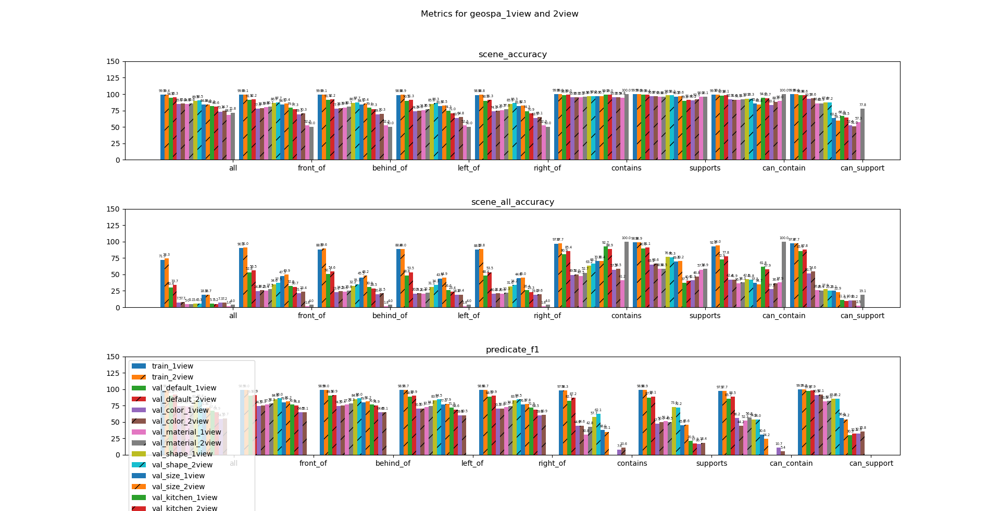
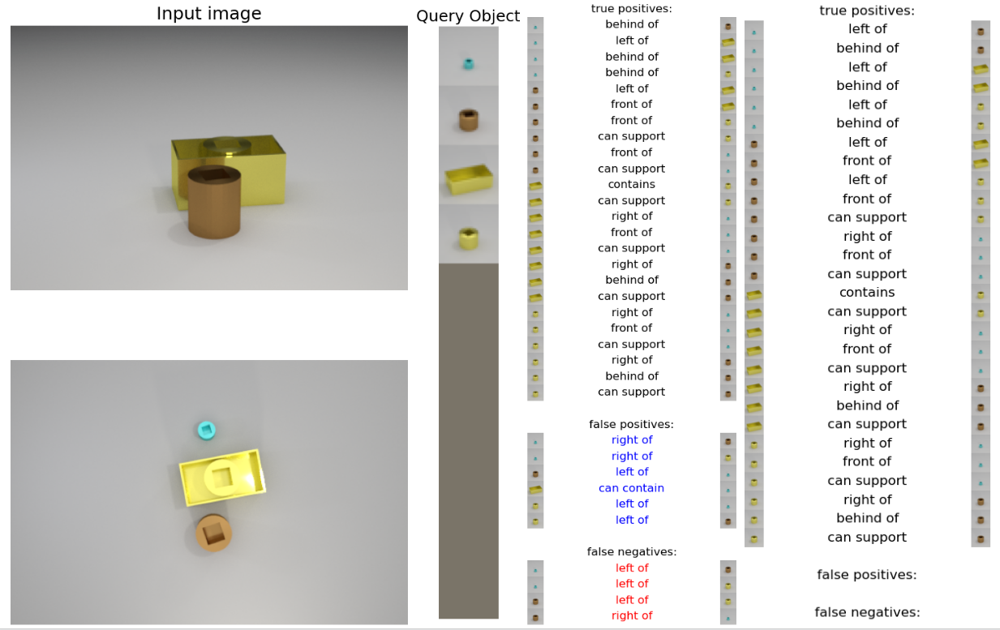

# GSORNet

## Introduction

# Dataset

### Related Work

There have been a range of impressive datasets for spacial reasoning models, including datasets using static image for directional relationships (CLEVR), videos for temporal and causal reasoning (CLEVERER), and videos including long term temporal and containment reasoning (CATER). Our diagnostic dataset is most similar to CLEVR, using static images with a fixed set of shapes, sizes, and materials. It includes ground truth information about the objects in each scene and the relative directional relationships between those objects (left, right, in front, behind). Our dataset improves on the previous examples by including new more complex ways for objects to be oriented in the scenes and more ground truth information for the relationships between objects. In addition to being placed “independently” on the table, objects can be contained within eachother, or supported on top of one another. In addition, we include the ground truth information for the possible relationships between objects; we store information about if objects could be contained or supported by other objects in the scene based on their relative sizes and shapes. The contain and support predicates are defined and discussed more below.

## Geometric Relationship Definitions

There are guidelines for how objects can be oriented within the scene depending on their size and shape. We came up with three distinct terms to describe the different methods of placing objects: independent, contained, and supported. Any object can be placed independently, meaning the object is placed on the table not touching any other objects. The contained and supported relationships are defined below:

**Contained:**
an object (containee) is able to be contained by another object (container) when more than half of the bounding box of the containee is able to fit inside of the bounding box of the container such that the container and containee are not intersecting. An equivalent definition would say that the center point of the bounding box of the containee must fit inside of the bounding box of the container. 

**Supported:**
 an object (supportee) can be supported by another object (supporter) if the cross section of the supporter’s bounding box along the table’s plane can fully contain the cross section of the supportee’s bounding box.
 
## Objects

In our primary dataset there are 14 unique shapes ranging in 3 different sizes for a total of 42 different shapes. There are also 2 different materials and 8 different colors.

### Shapes

### Materials

The two different materials are metal and rubber. The difference is that the rubber material is matte and non-reflective while the metal material is highly reflective.

### Colors

The 8 colors included in the main dataset are gray, red, blue, green, brow, purple, cyan, and yellow.

### Other objects

The scene generation code is designed so that is also very easy to change the properties for objects used in the scenes. A single file contains a list of all shapes, colors, materials, and sizes to use during generation. In order to change the objects in scenes a user only needs to create new Blender objects and change the parameters file for scene image generation. To test our model on novel scenes, we also created a kitchen dataset with the same colors and materials, but new objects

## Generation 

Our scene generation process is very similar to that of CLEVR. To generate a scene, we start with a hand-designed default scene containing 6 cameras, a flat gray plane to act as the table, and lighting. Each scene uses the same base table, cameras, and lights, but for each new scene, random jitter is added to the camera and light positions.

For each scene a random number between three and six objects is chosen. For each new object to add, a distinct combination of size, shape, material, and color are chosen. Then based on the size and shape of the new object, we create two lists: the existing objects in the scene which can act as supporters or containers, respectively, for the new object. It’s only possible for an object to have a single “child” containee or supportee, so if any object is already containing or supporting a child object, then it’s not appended to the list and not considered as a candidate. Next, the method of placement is randomly chosen for the object: independent, contained, or supported. If the chosen method is independent, then we choose a random position and orientation until the new object is not in collision with any existing objects. If the method is supported or contained, then a “parent” supporter or container is randomly chosen and the object is placed accordingly. 

Once all objects have been placed in a scene, the ground truth predicates are generated and the scene is saved. 

## Relationships

There are a total of 8 relationships included in the ground truth data: left, right, in front, behind, contains, supports, can contain, and can support. The left, right, in front, and behind predicates are generated the same as CLEVR and indicate the directional relationships between object pairs.  The contains and supports predicates indicate the current orientation of objects within the scene based on the placement type (independent, contained, supported). 

The can-contain and can-support predicates represent the potential for objects to fit contained inside of or supported on top of other objects based on the scene, including considering any objects already contained or supported. For both the can-contain and can-support relationships, object A can be contained/supported by object B if object A can be moved to fulfil the definition of the contain/support relationship (defined above) without disturbing any other objects in the scene. Some potential cases if object A can be contained/supported in object B are outlined below.

*Object A already a supporter.*
If object A is already supporting another object C, then it cannot be contained/supported by any other object B since object C would likely fall off. 

*Object A already a container.*
If object A is containing another object D, then object D will remain inside of object A even if object A is moved, so we must still consider if object B can contain/support object A. 

*Object B already a container/supporter.*
If object B is already containing/supporting object E, then when considering can contain/support of object A, we consider the size and shape of object E. We do not consider the position of object E i.e., it would be acceptable for object E’s position to shift slightly as we move object A into the relationship in/on object B. 

Definitions of can-contain and can-support predicates:

**Can-contain:**
Its possible for object A to be contained inside of object B such that object A can be moved into object B without disturbing any other objects in the scene. Any objects already contained within object B in the scene must be able to be in object B along with object A.

**Can-support:**
It’s possible for object A to be supported on object B such that object A can be moved onto object B without disturbing any other objects in the scene. Any objects already supported above object B in the scene must be able to be on object B along with object A.

---

# Model

### Related Work

For our training model we use the [SORNet](https://wentaoyuan.github.io/sornet/) design with slight modifications to accept our predicates and multiple camera views. To learn more about the implementation details of SORNet visit the dedicated website.

### Implementation

### Training and Hyperparameter

### Testing and Experiment Setup

## Results

### 1-view Results

#### Qualitative Analysis

#### Quantitative Analysis

Scene Accuracy:
Example: 10 “contains” 7 were predicted true. 10 “contains” 5 were predicted true -> scene accuracy of the model is 60%
Only considers unmasked predicates

Distribution of the predicates:
Contains, supports, and can_contain are heavily biased, as about 90% of the predicates are “negative.”

Sensitivity to unseen attributes
Color, material, and size similarly affected the accuracy of predictions.

### 2-view Results

#### Qualitative Analysis

Here, the 2 view models is performing better than the 1-view model as expected.
The 1 view model incorrectly predicts the small purple object’s spacial relations, because the model is unsure of that object’s position.
This is expected, as one cannot be sure whether the occluded object is inside the brown, behind the cyan, or behind the other purple object, just by looking at the first view.
However, it is worth noting that the 1-view model still correctly predicts that the small purple object is inside the brown cube container.
Ideally, if the model predicted that the purple object was inside the brown container, then it should have inferred the spacial relations more accurately, as the small purple object is strictly contained inside the container.

Rare occasion (1 in 10?) when the 2-view model performs worse than the 1-view model.

#### Quantitative Analysis

1 view had occlusions, leading to these errors, but 2view could resolve that

### Kitchen Objects

#### Qualitative Analysis

#### Quantitative Analysis

## Conclusion

### Larger Implications

### Future Work

## References
